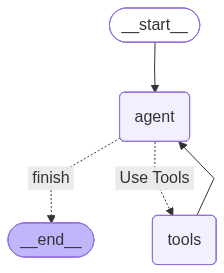

# Research Assistant Agent

An autonomous ReAct AI agent that retrieves relevant articles and academic papers on any topic and generates concise summaries — giving researchers a fast, reliable starting point instead of manually digging through search results.

🔗 **Live Demo:** [Try it here](https://huggingface.co/spaces/VakeesanM/Research-Assistant-Agent)

---

## How It Works

The agent follows the ReAct (Reason + Act) pattern, autonomously deciding which tools to call and in what order. Given a topic, it plans its own research workflow — searching the web and arXiv, extracting and summarizing content — and returns a research brief with links to every source it used.



---

## Tools & Tech Stack

**Agent Tools**

| Tool | Description |
|------|-------------|
| **Search** | Uses DuckDuckGo's API to find relevant URLs for a given query |
| **Content Extractor** | Fetches and parses the full text content of a webpage from its URL |
| **Summarizer** | Condenses extracted article content into a short summary |
| **getAbstract** | Uses arXiv's API to retrieve abstracts for relevant academic papers |
| **searchIdeas** | Uses Wikipedia's API to surface more specific, researchable subtopics when the user's query is too broad or vague |

**Tech Stack**
- LangChain / LangChain Community / LangChain OpenAI
- LangGraph
- Wikipedia API
- arXiv API
- DuckDuckGo API

---

## Running Locally

**Requirements:** OpenAI API key

```bash
git clone https://github.com/VakeesanM/Research-AI-Agent.git
cd Research-AI-Agent
pip install -r requirements.txt
streamlit run app/app.py
```

---

## Challenges & Solutions

- **DuckDuckGo only returns URLs, not content** — Built a custom content extractor to fetch and parse the actual page text.
- **Vague topics produced poor results** — Added a Wikipedia-powered `searchIdeas` tool to help the agent narrow broad queries into specific, researchable subtopics before searching.
- **Agent searched topics too literally** — Prompted the agent to generate deeper, more targeted questions around the topic before starting research, rather than searching the raw query.
- **Some sites blocked content extraction** — Added try/catch error handling and instructed the agent to skip URLs that returned errors instead of retrying them.
- **Long run times** — Set a recursion limit on the agent loop, cutting runtime with no meaningful drop in result quality.